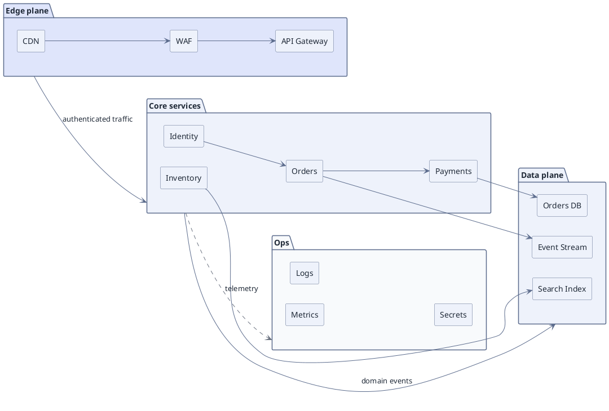

# Clustered Architecture with Cluster-to-Cluster Edges (PlantUML)

**Best for**: architecture overviews where edges should connect *groups* rather than individual boxes
**Avoid when**: the reader needs service icons (use a PlantUML cloud/network example)
**Answers**: how bounded contexts or planes relate, without drawing every internal edge

## Key Options

| Syntax | Effect |
|---|---|
| `package "name" as alias { … }` | A plane. The alias is what a plane-to-plane edge references |
| `package "Ops" as ops #f8fafc { … }` | Per-plane fill, so the planes are told apart by surface as well as by title |
| `edge --> core : label` | **Plane-to-plane edge** — the arrow is clipped to the package boundary, so the edge speaks about the group, with no `compound=true` to remember |
| `-[#6b7280,dashed]->` | Dashed cross-plane edge in a second colour |
| `rectangle "label" as alias` | A node inside a plane; the alias keeps the internal edges short |
| `left to right direction` | Planes side by side; drop the line to stack them |

## Data Shape

Clusters = **planes or bounded contexts**; internal edges = the few relationships worth showing inside a plane;
plane-to-plane edges = the cross-plane contract. Reader question: "what are the planes and how do they talk".

## Pitfalls

- ❌ `compound=true` + `lhead` / `ltail` → ✅ there is nothing to enable: a PlantUML edge between two package aliases is clipped to the boundary on its own
- ❌ Drawing every internal call → ✅ show the 1–3 edges per plane that define the plane's role
- ❌ Cross-plane edges landed on a random node → ✅ draw the edge between the package aliases, not between members
- ❌ Different fill for every cluster with no meaning → ✅ three planes maximum in practice; the fill *is* the grouping

## Alternatives

| Variant | Use instead |
|---|---|
| Vendor icons for cloud services | `aws-serverless-architecture.md` (plantuml + awslib or mxgraph icons) |
| Deployment/zone topology | `runtime-deployment-topology.md` |
| Dependency direction analysis | `dependency-graph.md` |

<!-- source: draw-uml 1.5.2 — package-to-package edges (`package "x" as p { }` then `p --> q`), per-package fill, verified with documd -->
