# Module Dependency Graph (PlantUML)

**Best for**: showing who depends on whom across modules, packages or services — and where the cycles are
**Avoid when**: you need data flow or call ordering (use a sequence diagram) or an architecture overview with icons
**Answers**: the dependency direction, the layering, and any accidental cycles

```plantuml
@startuml
skinparam RectangleBackgroundColor #eef2fb
skinparam RectangleBorderColor #5b6b8c
skinparam RectangleFontColor #1f2937
skinparam ComponentBackgroundColor #eef2fb
skinparam ComponentBorderColor #5b6b8c
skinparam ComponentFontColor #1f2937
skinparam ClassBackgroundColor #eef2fb
skinparam ClassBorderColor #5b6b8c
skinparam ClassFontColor #1f2937
skinparam UsecaseBackgroundColor #eef2fb
skinparam UsecaseBorderColor #5b6b8c
skinparam UsecaseFontColor #1f2937
skinparam DatabaseBackgroundColor #eef2fb
skinparam DatabaseBorderColor #5b6b8c
skinparam DatabaseFontColor #1f2937
skinparam NodeBackgroundColor #eef2fb
skinparam NodeBorderColor #5b6b8c
skinparam NodeFontColor #1f2937
skinparam ActorBackgroundColor #eef2fb
skinparam ActorBorderColor #5b6b8c
skinparam ActorFontColor #1f2937
skinparam StateBackgroundColor #eef2fb
skinparam StateBorderColor #5b6b8c
skinparam StateFontColor #1f2937
skinparam ArtifactBackgroundColor #eef2fb
skinparam ArtifactBorderColor #5b6b8c
skinparam ArtifactFontColor #1f2937
skinparam CloudBackgroundColor #eef2fb
skinparam CloudBorderColor #5b6b8c
skinparam CloudFontColor #1f2937
skinparam FolderBackgroundColor #eef2fb
skinparam FolderBorderColor #5b6b8c
skinparam FolderFontColor #1f2937
skinparam PackageBackgroundColor #eef2fb
skinparam PackageBorderColor #5b6b8c
skinparam DefaultFontColor #1f2937
skinparam ArrowColor #5b6b8c
skinparam ArrowFontColor #1f2937
skinparam NoteBackgroundColor #dfe5fb
skinparam NoteBorderColor #5b6b8c
skinparam NoteFontColor #1f2937
skinparam stereotypeABackgroundColor #d9e3f4
skinparam stereotypeABorderColor #5b6b8c
skinparam stereotypeCBackgroundColor #d9e3f4
skinparam stereotypeCBorderColor #5b6b8c
skinparam stereotypeEBackgroundColor #d9e3f4
skinparam stereotypeEBorderColor #5b6b8c
skinparam stereotypeIBackgroundColor #d9e3f4
skinparam stereotypeIBorderColor #5b6b8c
left to right direction

package "application" {
  rectangle "checkout-api" as checkout
  rectangle "admin-api" as admin
}

package "domain" {
  rectangle "orders" as orders
  rectangle "payments" as payments
  rectangle "inventory" as inventory
}

package "infrastructure" {
  rectangle "db" as db
  rectangle "queue" as queue
  rectangle "cache" as cache
}

' application may depend on domain, domain may depend on infrastructure —
' the reverse edges below are the ones worth reviewing
checkout --> orders
checkout --> payments
admin --> orders
admin --> inventory

orders --> db
orders --> queue
payments --> queue
inventory --> db
inventory --> cache

' a cycle (orders -> inventory -> orders), coloured so reviewers see it immediately
orders -[#d1242f]-> inventory : cycle

' infrastructure reaching back into domain code is an architecture smell
queue -[#d1242f,dashed]-> orders : callback
@enduml
```

## Key Options

| Syntax | Effect |
|---|---|
| `left to right direction` | Layering runs left→right; drop the line for top-down, which reads better for deep trees |
| `package "name" { … }` | A namespace box. `package "label" as alias` when the label is long and referenced later |
| `rectangle "label" as alias` | A plain box — the module or service unit. Aliases keep the arrows readable |
| `-->` | Directed dependency; `..>` is the dashed form for asynchronous or callback edges |
| `-[#d1242f]->` | Per-edge colour. The `#fill;line:border` suffix form used on nodes does **not** apply to arrows |
| `-[#d1242f,dashed]->` | Colour and line style together, comma-separated inside the bracket |

## Data Shape

A **layered digraph**: consumers on the left (or top), infrastructure on the right (or bottom). Every edge that
points "backwards" against the layering is a design finding — colour those, not the normal ones.

## Pitfalls

- ❌ A `cluster_` prefix on a package name → ✅ PlantUML packages need no prefix; `package "backend" { }` is the whole declaration
- ❌ Colouring an arrow with `#fill;line:border` → ✅ arrows take `-[#hex]->`; the node suffix is silently ignored on an edge
- ❌ Colouring every node → ✅ colour only anomalies; a rainbow graph hides the finding you want to communicate
- ❌ Drawing one giant graph → ✅ split by concern if the label count exceeds ~40 nodes

## Alternatives

| Variant | Use instead |
|---|---|
| Runtime call ordering | A sequence diagram (`api-interaction-sequence.md`) |
| Physical/network relations | `network-topology-enterprise.md` |
| Unstructured relationship networks | `relationship-network-neato.md` |

<!-- source: draw-uml 1.5.2 — `package` + `rectangle` + per-edge colour (`-[#hex,dashed]->`), rendered through documd -->
