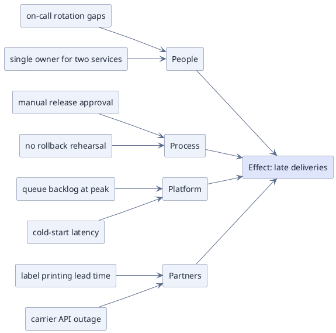

# Causal Tree / Cause Categories (PlantUML)

**Best for**: root-cause analysis where causes group into categories and converge on one observed effect
**Avoid when**: you need weighted or probabilistic analysis (use a table) or a solution tree rather than causes
**Answers**: which candidate causes exist for one effect, grouped by category

## Key Options

| Syntax | Effect |
|---|---|
| `rectangle "cause" as alias` | One box per cause; aliases keep the arrow lines short and readable |
| `left to right direction` | Causes read left→right into the effect; drop the line to read top→down |
| `#dfe5fb;line:5b6b8c` on the effect | Give the sink a second surface so it is not mistaken for another cause |
| Category nodes between causes and effect | Two levels only: cause → category → effect. Adding a third level turns the figure into a tree nobody reads |
| One arrow per cause | Direction is the message — resist drawing causes as a chain |

## Data Shape

One effect, 4–6 cause categories, 2–4 causes each. The diagram is for **hypothesis generation**: after the
discussion, highlight the shortlisted causes (colour) so the diagram becomes a record of the analysis.

## Pitfalls

- ❌ Expecting the classic Ishikawa spine → ✅ this is a *cause tree*; a horizontal spine needs rank control this engine does not expose. If the bone shape is the point, say so in the copy instead of forcing it
- ❌ More than six categories → ✅ six is the practical limit; merge or drop
- ❌ Causes stated as solutions ("add more servers") → ✅ keep causes descriptive; solutions belong in a separate list
- ❌ No prioritisation → ✅ highlight the agreed candidates, otherwise the exercise has no output

## Alternatives

| Variant | Use instead |
|---|---|
| Weighted/prioritised causes | A GFM table or a risk register card |
| Decision tree with outcomes | `module-import-arcs.md`, or a labelled-edge tree in the same rectangle syntax |
| Process flow with responsible roles | `approval-workflow-swimlane.md` |

<!-- source: draw-uml 1.5.2 — rectangle tree converging on one sink, per-node `#fill;line:border`; verified with documd -->
