# Relationship Network — Service Mesh (PlantUML)

**Best for**: an unstructured relation list where the reader asks who is central, who is peripheral, who is alone
**Avoid when**: the *clustering* is the question (use an ECharts force layout, `graph-platform-dependencies.md`)
**Answers**: which services are hubs, which are leaves, and which one nobody talks to

```plantuml
@startuml
skinparam RectangleBackgroundColor #eef2fb
skinparam RectangleBorderColor #5b6b8c
skinparam RectangleFontColor #1f2937
skinparam ComponentBackgroundColor #eef2fb
skinparam ComponentBorderColor #5b6b8c
skinparam ComponentFontColor #1f2937
skinparam ClassBackgroundColor #eef2fb
skinparam ClassBorderColor #5b6b8c
skinparam ClassFontColor #1f2937
skinparam UsecaseBackgroundColor #eef2fb
skinparam UsecaseBorderColor #5b6b8c
skinparam UsecaseFontColor #1f2937
skinparam DatabaseBackgroundColor #eef2fb
skinparam DatabaseBorderColor #5b6b8c
skinparam DatabaseFontColor #1f2937
skinparam NodeBackgroundColor #eef2fb
skinparam NodeBorderColor #5b6b8c
skinparam NodeFontColor #1f2937
skinparam ActorBackgroundColor #eef2fb
skinparam ActorBorderColor #5b6b8c
skinparam ActorFontColor #1f2937
skinparam StateBackgroundColor #eef2fb
skinparam StateBorderColor #5b6b8c
skinparam StateFontColor #1f2937
skinparam ArtifactBackgroundColor #eef2fb
skinparam ArtifactBorderColor #5b6b8c
skinparam ArtifactFontColor #1f2937
skinparam CloudBackgroundColor #eef2fb
skinparam CloudBorderColor #5b6b8c
skinparam CloudFontColor #1f2937
skinparam FolderBackgroundColor #eef2fb
skinparam FolderBorderColor #5b6b8c
skinparam FolderFontColor #1f2937
skinparam PackageBackgroundColor #eef2fb
skinparam PackageBorderColor #5b6b8c
skinparam DefaultFontColor #1f2937
skinparam ArrowColor #5b6b8c
skinparam ArrowFontColor #1f2937
skinparam NoteBackgroundColor #dfe5fb
skinparam NoteBorderColor #5b6b8c
skinparam NoteFontColor #1f2937
skinparam stereotypeABackgroundColor #d9e3f4
skinparam stereotypeABorderColor #5b6b8c
skinparam stereotypeCBackgroundColor #d9e3f4
skinparam stereotypeCBorderColor #5b6b8c
skinparam stereotypeEBackgroundColor #d9e3f4
skinparam stereotypeEBorderColor #5b6b8c
skinparam stereotypeIBackgroundColor #d9e3f4
skinparam stereotypeIBorderColor #5b6b8c

' teams that talk to each other
rectangle "checkout" as checkout
rectangle "payments" as payments
rectangle "inventory" as inventory
rectangle "identity" as identity
rectangle "ledger" as ledger
rectangle "fraud" as fraud
rectangle "warehouse" as warehouse
rectangle "logistics" as logistics
rectangle "directory" as directory
rectangle "support" as support
rectangle "orders-ui" as ordersui
rectangle "analytics" as analytics

checkout --> payments
checkout --> inventory
checkout --> identity
payments --> ledger
payments --> fraud
fraud --> ledger
inventory --> warehouse
warehouse --> logistics
identity --> directory
identity --> support
support --> ordersui
ordersui --> checkout
analytics --> ledger
analytics --> warehouse

' deliberately isolated: no ties at all — it reads as the one node with nothing attached
rectangle "legacy-billing" as legacy #dfe5fb;line:5b6b8c
@enduml
```

## Key Options

| Syntax | Effect |
|---|---|
| `rectangle "name" as alias` | One box per node — no coordinates are ever written |
| `-->` / `--` | A relation; `--` is the symmetric form when direction would be a lie |
| `#dfe5fb;line:5b6b8c` on one node | Marks the outlier by surface, so it does not need to be hunted for |
| Declaration order | Nodes are declared before the edges; ELK ranks them from the edge direction, so the mesh settles into layers |
| One edge per relation | Do not add weights — this engine has no edge weight, and an invented number is worse than none |

## Data Shape

Nodes + edges, nothing else. The layout is computed, so the same source always gives the same picture —
which is the point: the figure is a record, not an illustration.

## Pitfalls

- ❌ Expecting force-directed clustering → ✅ this is a **ranked** layout: hubs, leaves and isolated nodes are visible, emergent clusters are not. For clustering, use the ECharts force example instead
- ❌ Reading direction into every edge → ✅ use `--` when the relation is symmetric, otherwise readers assume a flow
- ❌ A dense mesh with no isolates → ✅ the isolated node is usually the finding; keep it in the figure
- ❌ Unweighted edges pretending to be weighted → ✅ if strength matters, encode it in the copy or move to a chart that has a weight channel
- ❌ Declaring the edges before the nodes → ✅ declare every node first; a relation to an undeclared name silently creates a plain box with no theme surface

## Alternatives

| Variant | Use instead |
|---|---|
| Emergent clusters, force-directed | `graph-platform-dependencies.md` (echarts force) |
| Ordered ring of the same nodes | `service-ownership-circle-graph.md` (echarts circular) |
| Hub-and-spoke centre | `radial-hub-network.md` |
| Graph with role-based icons | plantuml examples (network/cloud icon families) |

<!-- source: draw-uml 1.5.2 — unweighted relation map over `rectangle` nodes, per-node surface override; verified with documd -->
