# Data Structure / Table Nodes (PlantUML)

**Best for**: showing structure *inside* nodes — records, structs, memory layouts, request/response schemas
**Avoid when**: plain boxes are enough (use a dependency graph) or you need an ER diagram with cardinalities
**Answers**: what each node contains, field by field

```plantuml
@startuml
skinparam RectangleBackgroundColor #eef2fb
skinparam RectangleBorderColor #5b6b8c
skinparam RectangleFontColor #1f2937
skinparam ComponentBackgroundColor #eef2fb
skinparam ComponentBorderColor #5b6b8c
skinparam ComponentFontColor #1f2937
skinparam ClassBackgroundColor #eef2fb
skinparam ClassBorderColor #5b6b8c
skinparam ClassFontColor #1f2937
skinparam UsecaseBackgroundColor #eef2fb
skinparam UsecaseBorderColor #5b6b8c
skinparam UsecaseFontColor #1f2937
skinparam DatabaseBackgroundColor #eef2fb
skinparam DatabaseBorderColor #5b6b8c
skinparam DatabaseFontColor #1f2937
skinparam NodeBackgroundColor #eef2fb
skinparam NodeBorderColor #5b6b8c
skinparam NodeFontColor #1f2937
skinparam ActorBackgroundColor #eef2fb
skinparam ActorBorderColor #5b6b8c
skinparam ActorFontColor #1f2937
skinparam StateBackgroundColor #eef2fb
skinparam StateBorderColor #5b6b8c
skinparam StateFontColor #1f2937
skinparam ArtifactBackgroundColor #eef2fb
skinparam ArtifactBorderColor #5b6b8c
skinparam ArtifactFontColor #1f2937
skinparam CloudBackgroundColor #eef2fb
skinparam CloudBorderColor #5b6b8c
skinparam CloudFontColor #1f2937
skinparam FolderBackgroundColor #eef2fb
skinparam FolderBorderColor #5b6b8c
skinparam FolderFontColor #1f2937
skinparam PackageBackgroundColor #eef2fb
skinparam PackageBorderColor #5b6b8c
skinparam DefaultFontColor #1f2937
skinparam ArrowColor #5b6b8c
skinparam ArrowFontColor #1f2937
skinparam NoteBackgroundColor #dfe5fb
skinparam NoteBorderColor #5b6b8c
skinparam NoteFontColor #1f2937
skinparam stereotypeABackgroundColor #d9e3f4
skinparam stereotypeABorderColor #5b6b8c
skinparam stereotypeCBackgroundColor #d9e3f4
skinparam stereotypeCBorderColor #5b6b8c
skinparam stereotypeEBackgroundColor #d9e3f4
skinparam stereotypeEBorderColor #5b6b8c
skinparam stereotypeIBackgroundColor #d9e3f4
skinparam stereotypeIBorderColor #5b6b8c
hide circle
hide methods

' each node is a titled table: the title is the header row, the body lines are the fields
class "TCP header" as header #eef2fb;line:265aac {
  src port
  dst port
  sequence number
  acknowledgment
  flags (9 bits)
}

class "Payload" as payload #eef2fb;line:0d8888 {
  application data
  length: variable
}

class "Connection state" as conn #eef2fb;line:5728e4 {
  ESTABLISHED
  TIME_WAIT
}

header --> conn : after handshake
header --> payload : carries
@enduml
```

## Key Options

| Syntax | Effect |
|---|---|
| `class "TCP header" as header { … }` | **The table node.** One line per field — the renderer draws a header row plus one row per line |
| `hide circle` / `hide methods` | Drop the class badge and the empty methods compartment, so the node reads as a plain table |
| `class "X" as x #eef2fb;line:265aac` | Per-node accent: `#fill` then `;line:border`. The `;` form works on every shape; `##border` is legal on the class family only |
| `header --> conn : label` | Edges attach to the **node** — PlantUML has no per-field port |
| `hide fields` | The inverse: a titled node with no body rows |

## Data Shape

Each node is a small table. Field lines are plain text; a leading `+` / `-` / `#` is read as a
visibility marker and gets the class-diagram icon treatment, so leave it off for schema fields.

## Pitfalls

- ❌ Expecting an edge to attach to a field → ✅ PlantUML cannot attach an edge to a field; use one node per row, or an ER diagram with cardinalities
- ❌ Leaving the class badge in place → ✅ `hide circle`, otherwise every table carries a meaningless letter
- ❌ Writing `class X { +String name }` on one line → ✅ the multi-line form; the one-line nesting block is not portable
- ❌ A `|` inside a field line → ✅ that is record syntax, not PlantUML; one field per line

## Alternatives

| Variant | Use instead |
|---|---|
| Plain boxes and arrows | `dependency-graph.md` |
| Field-level links between nodes | One node per row, or `entity-relationships-crows-foot.md` for cardinalities |

<!-- source: draw-uml 1.5.2 — class node with a field-only body, `hide circle` / `hide methods`, per-node `#fill;line:border`; verified with documd -->
