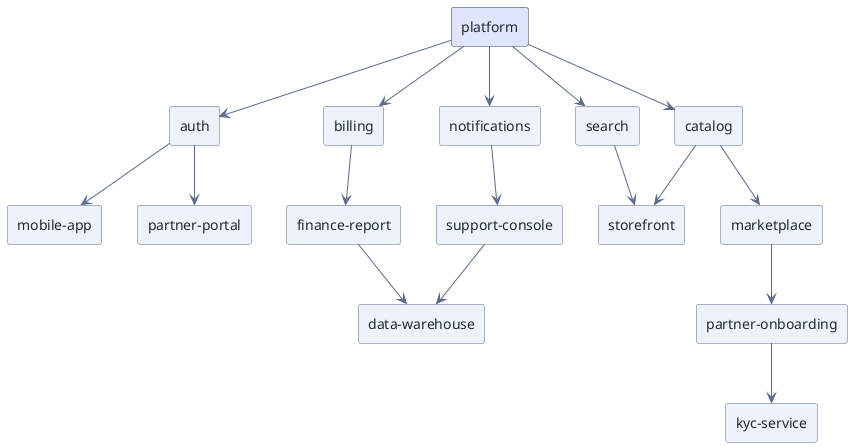

# Hub-and-Spoke Network (PlantUML)

**Best for**: one central node with layers of satellites — platform ecosystem, root-cause radius, network maps
**Avoid when**: there are several equally-important hubs (use `relationship-network-neato.md`) or strict hierarchy matters
**Answers**: what hangs off the centre, and how directly each thing relates to it

## Key Options

| Syntax | Effect |
|---|---|
| One hub, everything else pointing away | The reading is *distance from the centre*: rank 1 is the hub's own row, rank 2 the next, and so on |
| `rectangle "platform" as platform #dfe5fb;line:334155` | A second surface plus a stronger border makes the hub unmistakable at a glance |
| `platform --> auth` | Every spoke is one line; do not chain satellites together, or the ranks collapse |
| Declaration order | Declare the rings in order — the hub, then ring 1, then ring 2 — so the ranks follow the reading |
| `left to right direction` | Turns the rings into columns when the figure has to fit a page width |

## Data Shape

One hub, then layers of increasing distance: direct integrations at layer 1, consumers at layer 2, supporting
systems at layer 3. The reader question is "what is close to the platform and what is peripheral".

## Pitfalls

- ❌ Expecting concentric rings → ✅ this engine computes **ranks**, not radii; the reading is distance in *hops*, and the copy should say so. For a true ring, use `service-ownership-circle-graph.md`
- ❌ Several hubs in one figure → ✅ pick one root; a second centre flattens the whole graph into one rank
- ❌ Long chains hanging off the hub → ✅ a chain of five adds four ranks nobody asked about; hang consumers directly off their capability
- ❌ Satellite-to-satellite edges → ✅ they create short-circuits that break the layer reading

## Alternatives

| Variant | Use instead |
|---|---|
| Multiple hubs, no clear centre | `relationship-network-neato.md` |
| Strict hierarchy / org chart | The same rectangle tree with `top to bottom direction` |
| A true ring of equal nodes | `service-ownership-circle-graph.md` (echarts circular) |
| Ecosystem map with brand icons | plantuml cloud icon families (`mxgraph.aws4`, `awslib`) |

<!-- source: draw-uml 1.5.2 — one hub with layered spokes over `rectangle` nodes; per-node `#fill;line:border` on the hub; verified with documd -->
