# Photocopy-Safe Dependency Graph (PlantUML, print theme)

**Best for**: a handout that will be printed, photocopied, or read on a fax-grade screen
**Avoid when**: the figure needs eight distinguishable categories — a mono ladder has five usable steps
**Answers**: what depends on what, in a figure that survives losing its colour

```plantuml
@startuml
skinparam RectangleBackgroundColor #f3f4f6
skinparam RectangleBorderColor #4b5563
skinparam RectangleFontColor #111827
skinparam ComponentBackgroundColor #f3f4f6
skinparam ComponentBorderColor #4b5563
skinparam ComponentFontColor #111827
skinparam ClassBackgroundColor #f3f4f6
skinparam ClassBorderColor #4b5563
skinparam ClassFontColor #111827
skinparam UsecaseBackgroundColor #f3f4f6
skinparam UsecaseBorderColor #4b5563
skinparam UsecaseFontColor #111827
skinparam DatabaseBackgroundColor #f3f4f6
skinparam DatabaseBorderColor #4b5563
skinparam DatabaseFontColor #111827
skinparam NodeBackgroundColor #f3f4f6
skinparam NodeBorderColor #4b5563
skinparam NodeFontColor #111827
skinparam ActorBackgroundColor #f3f4f6
skinparam ActorBorderColor #4b5563
skinparam ActorFontColor #111827
skinparam StateBackgroundColor #f3f4f6
skinparam StateBorderColor #4b5563
skinparam StateFontColor #111827
skinparam ArtifactBackgroundColor #f3f4f6
skinparam ArtifactBorderColor #4b5563
skinparam ArtifactFontColor #111827
skinparam CloudBackgroundColor #f3f4f6
skinparam CloudBorderColor #4b5563
skinparam CloudFontColor #111827
skinparam FolderBackgroundColor #f3f4f6
skinparam FolderBorderColor #4b5563
skinparam FolderFontColor #111827
skinparam PackageBackgroundColor #f3f4f6
skinparam PackageBorderColor #4b5563
skinparam DefaultFontColor #111827
skinparam ArrowColor #4b5563
skinparam ArrowFontColor #111827
skinparam NoteBackgroundColor #e5e7eb
skinparam NoteBorderColor #4b5563
skinparam NoteFontColor #111827
skinparam stereotypeABackgroundColor #d4d5d8
skinparam stereotypeABorderColor #4b5563
skinparam stereotypeCBackgroundColor #d4d5d8
skinparam stereotypeCBorderColor #4b5563
skinparam stereotypeEBackgroundColor #d4d5d8
skinparam stereotypeEBorderColor #4b5563
skinparam stereotypeIBackgroundColor #d4d5d8
skinparam stereotypeIBorderColor #4b5563
left to right direction

' the two highlighted families step down the mono ladder — same hue, different weight
rectangle "Billing" as billing #a3abb6;line:6b7280
rectangle "Auth" as auth #868f9b;line:6b7280
rectangle "Ledger" as ledger
rectangle "Reporting" as reporting
rectangle "Export" as export

auth --> billing
billing --> ledger
auth --> ledger
ledger --> reporting
reporting --> export
@enduml
```

## Data Shape

One node per service or module, one edge per dependency. Keep the graph at the level where an edge
means something a reader would defend in a review.

## Key Options

| Option | Effect |
|---|---|
| The `skinparam` block | Every node and edge gets the theme, including the ones not named |
| `#a3abb6;line:6b7280` on one node | Steps that node down the mono ladder without restating the whole block |
| `left to right direction` | Turns a deep chain into a wide one — better for a page's aspect ratio |
| The print theme, not the default | The figure is graded against the paper, so the block has to be this theme's — mixing themes in one document is the thing to avoid |

## Pitfalls

- ❌ Relying on colour to carry a category → ✅ in a mono theme, label it or vary the weight; red and green print identically
- ❌ A fill without a border in a darker step → ✅ the border is what survives a bad photocopy; keep the `;line:` half of the pair
- ❌ Adding a second accent "for emphasis" → ✅ the mono ladder *is* the emphasis scale; a stray colour defeats the point
- ❌ Reaching for the default theme's blue on a print figure → ✅ it renders fine and prints as a grey blob; the print theme exists for this

## Alternatives

| Variant | Use instead |
|---|---|
| A coloured version for screen | `module-import-arcs.md` |
| A layered architecture view | `package-layering.md` |
| A long-form policy diagram | `editorial-policy-flow.md` |

<!-- source: theme showcase — Print theme, plantuml structure block + per-node mono-ladder override -->
