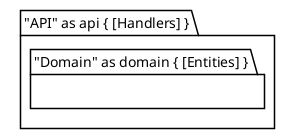

# PlantUML 样式语法对照：官方 `plantuml` vs `documd`（draw-uml）

> 状态：**第三轮实测（2026-09-22），对象 = 已发布的 `@markdown-viewer/draw-uml` 1.5.1**。
> 用途：[`plans/style-palette-plan.md`](../../../plans/style-palette-plan.md) §5.1 的「参数可用性表」
> 证据来源，以及 `engines/plantuml.md` 的约束依据。
>
> **结论先行**：本引擎**不是** PlantUML。样式语法实现的是一个子集，且实现范围**按图类型不均**。
> 但 1.5.1 修掉了此前最危险的几条：单行嵌套块静默变空图、`!define` 不展开、序列图别名键无效、
> 元素级 `#fill##border` 拼出非法色值，全部已确认（§11）。写样式前仍应查本文档，不要按官方文档假设。
>
> **阅读顺序**：§11 是最新且唯一的权威结论（1.5.1 实测 + 对 §10「工作区版本」逐条对账）；
> §9 / §10 保留为历史记录；正文 §3–§6 的 documd 列已按 **1.5.1** 全量重测更新。
>
> ❗ **升级后必须重建 CLI 包**：`@markdown-viewer/draw-uml` 是**构建期**打进 `dist/cli/browser-renderer.js` 的，
> 不是运行时解析。只 `npm install` 而不 `npm run build:cli`，CLI 仍在跑旧引擎 —— 这正是 §10 与 CLI 实测
> 长期不一致的原因（§8 第三轮）。

---

## 1. 环境与对照对象

| 侧 | 版本 | 调用方式 |
|---|---|---|
| 官方 | **PlantUML 1.2026.6**（Homebrew，jar 29.5 MB）+ Temurin JDK 17.0.17 | `plantuml -tsvg -pipe < file.puml` |
| 本仓库（当前） | documd 5.3.1 → `@markdown-viewer/draw-uml` **1.5.2** → `@markdown-viewer/drawio2svg` 1.5.5 | `node dist/cli/documd.js <file.puml> <out.svg>` |
| 本仓库（历史） | 1.4.8 首测 · 1.5.0 复测（§9）· 1.5.1 第三轮（§11）· 工作区三阶段修复（§10） | 同上 |
| 上游 fixture 基线 | `~/works/draw-uml-dev` 工作区源码（`fibjs scripts/verify-style-fixtures.mjs`） | 见 §11 |

两侧都输出 SVG，直接比对颜色与结构。**渲染主题不同**（见 §11.3）：fixture 基线用
`{ fontSize: 16, fontFamily: 'Times New Roman, serif' }`，而 CLI / 查看器按 `fontSize: 12` 渲染，
因此由主题派生的数值相差 0.75×（`strokeWidth` 1 vs 1.3333、`arcSize` 10 vs 13.3333 …）；
倍数关系（如 legacy `line.bold` 的 ×2）不受影响 —— 比较绝对数值前必须先换算。

---

## 2. 方法

三条独立判据（`probe-style-matrix.mjs` 全部实现），外加一个独立的交叉核对：

1. **哨兵色法（颜色类）** —— 每条指令配一个默认输出不可能出现的**浅色**哨兵（`#cde7ff` 填充 / `#2e7dd1` 描边 /
   `#7a3e9d` 文字 / `#aabbcc` 背景 / `#e07b39` 箭头 / `#2f9e68` 生命线；浅色是刻意的：深哨兵在小图里就是黑块，
   人工核对时分不出「上了色」和「没上色」）。先做 `rgb()` → `#rrggbb` 归一化，再要求它是**合法色值 token**
   （前一位不是 `#`，后一位不是十六进制位）。`#cde7ff##2e7dd1` 这类拼接值**不算命中** —— 它是 P0-2 缺陷
   （渲染器会丢弃的非法色），不是「指令生效」。
2. **指纹 diff（非颜色类）** —— 每条探针**渲染两次**：带指令一次、不带指令一次（图体相同），只比较这两者的差异
   （画布尺寸 + 字号 + 线宽 + `rx` + 字体 + 颜色集 + 元素种类）。这样「指令有效果」和「图本来就不一样」被分开。
3. **静默空图检测** —— 输出 < 600 B 视为空图（本引擎的空图恒为 **342 B**，与 `@startwbs` 的静默失败同尺寸）。
4. **fixture 交叉核对** —— `verify-fixtures.mjs` 把**上游自己的 41 个 fixture** 灌进**打包后的 CLI**，
   按上游 `expectations.json` 的断言逐条判定（PASS / TODO / FAIL），用来回答「工作区版修好了，发布版也有吗」。

---

## 3. 结论摘要

| 类别 | 实测结果（draw-uml **1.5.1**，2026-09-22 第三轮） |
|---|---|
| 元素类型 `BackgroundColor/BorderColor/FontColor` | ✅ **14 类 × 3 属性共 42 条全部支持**，唯一例外 `PackageFontColor`（§4.2） |
| 嵌套 `skinparam X { … }` 与 `skinparam X<<tag>> { … }` | ✅ 支持，且键名大小写不敏感（`alllower` / `canonical` / `camel` 等价） |
| 元素级颜色后缀 | ✅ `#fill` · `##border` · `#fill##border` · `#line:;back:;text:` · legacy `#f;line:x;line.bold;text:z` **全部三色可控，且都是合法色值** |
| 全局 `ArrowColor` / `ArrowFontColor` / `DefaultFontColor` | ✅ 支持（`ArrowFontColor` 含边标签子 cell） |
| 序列图 | ✅ `Participant*` · `SequenceLifeLineBorderColor` · `sequenceArrowColor` · `skinparam sequence { … }` 全部生效 |
| 注释 `NoteBackgroundColor` / `NoteBorderColor` / `NoteFontColor` | ✅ 全部支持 |
| `<style>` 块 | ✅ `root` · `rectangle` · `classDiagram` · `activityDiagram` · `participant` 生效；❌ `<style> activity` · `<style> sequenceDiagram` 无效 |
| 活动图色参 | ⚠️ `ActivityBackgroundColor` / `ActivityBorderColor` / `ActivityDiamondBackgroundColor` 生效；❌ `ActivityStartColor` 无效 |
| 类图色参 | ⚠️ `ClassArrowColor` 生效；❌ `ClassHeaderBackgroundColor` / `ClassAttributeFontColor` 无效 |
| 图例 / 标题 | ❌ `LegendBackgroundColor` · `LegendBorderColor` · `TitleFontColor` 全部无效 |
| `!define` 色别名 | ✅ 生效；值**不带 `#`** ：`!define BRAND cde7ff` + `rectangle R #BRAND` |
| 布局参数 | ✅ `roundcorner` · `DefaultFontSize` · `nodesep` · `ArrowThickness` 生效；❌ `Padding`（有意不实现）· `shadowing` · `defaultFontName` · `handwritten` · `monochrome` · `linetype ortho` 完全无效果 |
| `!theme <name>` | ⚠️ 只有 `plain` 生效（默认填充 `#f1f1f1` → `#ffffff`），其它主题被忽略 |
| `skinparam backgroundColor` | ❌ 无效（导出链路本来就要求透明背景，无害） |
| **单行嵌套块 `X { … }`** | ✅ **已修复**：8 种容器全部出图（2851–3865 B），与多行对照同尺寸 |

总计 118 条探针：**82 yes · 7 effect · 9 ok · 13 no · 7 ignored**（1.5.2 实测）。
`stereotype<字母>*` 已于 1.5.2 落地（5 条翻 `yes`，见 §11.5）；剩下 2 条刻意为 `no`
（`stereotypeCFontColor`、无字母形式）—— 官方本身就是无效键，那是**正确结果**而不是待办。

---

## 4. 对照矩阵

### 4.1 全局 skinparam

| 指令 | 官方 | documd | 判定 |
|---|---|---|---|
| `skinparam DefaultFontColor` | yes | yes | ✅ both |
| `skinparam ArrowColor` | yes | yes | ✅ both |
| `skinparam ArrowFontColor` | yes | yes | ✅ both（类图边标签也上色） |
| `skinparam backgroundColor` | yes | no | ⚠️ official only |
| `skinparam ArrowThickness 5` | yes | yes | ✅ both（实测 `stroke-width` 1 → 5） |
| `skinparam Padding 30` | yes | **ignored** | ⚠️ **有意不实现**：输出与无指令基线逐字节相同 |
| `skinparam DefaultFontSize 24` | yes | yes | ✅ both（画布 83×40 → 162×75，`font-size` 12 → 24） |
| `skinparam nodesep 200` | yes | yes | ✅ both（画布 145×115 → 325×115） |

> `backgroundColor` 不支持对本计划**无害**：导出链路本来就要求透明背景。
> `Padding` 不支持是**有意设计**（它只影响画布外留白，DrawIO→SVG 链路没有干净挂点）。
>
> ⚠️ **非 UML 图类型不吃 skinparam**（1.5.2 实测）：`@startmindmap` · `@startgantt` · `@startpacketdiag` ·
> `@startwbs` 加不加全局键，输出**字节级相同**（3136 / 7701 / 5480 B 一一对应）—— 所以 plantuml block
> 对这四个类型是「不适用」，而不是「缺失」。

### 4.2 元素类型 × 属性（14 类全测）

| 元素类型 | `…BackgroundColor` | `…BorderColor` | `…FontColor` |
|---|---|---|---|
| Rectangle | ✅ both | ✅ both | ✅ both |
| Component | ✅ both | ✅ both | ✅ both |
| Class | ✅ both | ✅ both | ✅ both |
| Usecase | ✅ both | ✅ both | ✅ both |
| Database | ✅ both | ✅ both | ✅ both |
| Node | ✅ both | ✅ both | ✅ both |
| Actor | ✅ both | ✅ both | ✅ both |
| State | ✅ both | ✅ both | ✅ both |
| Note | ✅ both | ✅ both | ✅ both |
| Artifact | ✅ both | ✅ both | ✅ both |
| Cloud | ✅ both | ✅ both | ✅ both |
| Folder | ✅ both | ✅ both | ✅ both |
| Package | ✅ both | ✅ both | ❌ neither |
| Participant（序列图） | ✅ both | ✅ both | ✅ both |
| `SequenceLifeLineBorderColor` | ✅ both | | |

十四类 × 三属性共 42 条探针（本轮全部实测，不再有未测格）。唯一无效键是 `PackageFontColor`。
每条探针的图表都**包含该元素类型本身** —— 一轮手工测试曾用只含 `package` / `[component]` 的图去验
`Rectangle*`，结果把「没有作用对象」误判为「功能未实现」（§8 第一轮）。

### 4.3 嵌套与构造型

| 指令 | 官方 | documd | 判定 |
|---|---|---|---|
| `skinparam rectangle { BackgroundColor }` | yes | yes | ✅ both |
| `skinparam rectangle { BorderColor }` | yes | yes | ✅ both |
| `skinparam rectangle { FontColor }` | yes | yes | ✅ both |
| `skinparam rectangle<<tag>> { BackgroundColor }` | yes | yes | ✅ both |
| `skinparam rectangle<<tag>> { BorderColor }` | yes | yes | ✅ both |
| `skinparam stereotypeCBackgroundColor` | yes | yes | ✅ **1.5.2 起可用**（1.4.8–1.5.1 均不可用） |
| `skinparam stereotypeCBorderColor` | yes | yes | ✅ **1.5.2 起可用** |

> #### `stereotype<字母>*`：**1.5.2 已实现，验收通过**
>
> 实测（2026-09-22，本轮）：fixture `030-stereotype-spot-color` **PASS**；探针 `4.3` 节
> **恰好 5 条从 `no` 翻 `yes`**（`C`/`I`/`E`/`A` 的 `BackgroundColor` + `CBorderColor`），
> 其余 113 条零变化。实现要点（`shared/spot.ts`）：键按**圆章字母**寻址，`class A <<x>>` + `stereotypeC*`
> 才生效，`interface I1` + `stereotypeC*` 保持不变；`skinparam.ts` 已把该族从
> `UNSUPPORTED_SKINPARAM` 移出（未知字母如 `stereotypeQ*` 仍报 unsupported）。
>
> 下面的部分保留为**历史**：它记录了 1.4.8–1.5.1 为何始终不生效，以及可移植的替代写法。
>
> 官方这两个键控制的是**元素类型圆章（type spot）的颜色** —— 带构造型的元素会在名字旁多一个小圆章，
> 字母表示类型（`C` class · `I` interface · `A` abstract · `E` enum · `S` struct/stereotype · `P` protocol ·
> `X` exception · `M` metaclass · `@` annotation）。实测：
>
> | 写法 | 官方输出变化 |
> |---|---|
> | `class A <<x>>`（基线） | 圆章 `fill=#ADD1B2`、`stroke=#6E9073` |
> | `+ skinparam stereotypeCBackgroundColor #CDE7FF` | 圆章 `fill` → `#CDE7FF`（**替换**，不是叠加） |
> | `+ skinparam stereotypeCBorderColor #CDE7FF` | 圆章 `stroke` → `#CDE7FF`（`fill` 保持 `#ADD1B2`） |
> | `+ skinparam stereotypeCFontColor #CDE7FF` | 无可观察变化（圆章里的字母仍为黑色） |
>
> **本引擎的圆章颜色是硬编码表**：`primitives/class-node.ts` 的 `SPOT_MAP`
> （`class: { char: 'C', lightColor: '#ADD1B2', darkColor: '#2E5233' }` …），全仓**没有任何代码读取
> `stereotype*` 颜色键**，而 `stereotypec` 也不在键分表里能服务的元素前缀集合中 —— 所以该键解析后
> **没有作用对象**，被归类为 `UNSUPPORTED_SKINPARAM` 诊断（**可控失败，不是静默**）。
>
> ⚠️ 本文档早前写的「1.4.8 可用 → 1.5.0 回归」**不成立**：那个结论来自已被推翻的
> 子串搜索判定器（§8 第二轮），上游自己在 1.4.9 上的实测也是失效。请按「从未实现」对待。
>
> **三个今天就能用的绕过法**（前两个两侧都支持，第三个是逐元素写法）：
>
> ```plantuml
> skinparam classBackgroundColor<<x>> #CDE7FF     ' ① inline，marker 必须在末尾
> skinparam class<<x>> { BackgroundColor #CDE7FF } ' ② 嵌套块（fixture 026）
> class A <<(C,#CDE7FF)>>                         ' ③ 逐元素自定义圆章，官方同样支持
> ```
>
> ⚠️ 拼写陷阱：`skinparam class<<x>>BackgroundColor #CDE7FF`（marker 夹在中间）在本引擎下是
> `UNKNOWN_SKINPARAM`，**不生效**，虽然官方会先归一再解析。
>
> **验收清单 —— 已逐条核对完毕（1.5.2 实测）**
>
> | 要求 | 期望 | 结果 |
> |---|---|---|
> | `stereotypeCBackgroundColor` 生效 | 圆章 `fill` **替换**为哨兵色 | ✅ 翻 `yes` |
> | `stereotypeCBorderColor` 生效 | 圆章 `stroke` 变哨兵色，`fill` 保持默认 | ✅ 翻 `yes` |
> | 字母家族覆盖 `A` / `E` / `I` | 同上（官方四个字母都生效） | ✅ 三条都翻 `yes` |
> | 无字母形式**不得**生效 | 官方本身无效 | ✅ 保持 `no` |
> | `stereotypeCFontColor` | 官方无可观察效果：本引擎也无效即为一致 | ✅ 保持 `no`（未为它偏离官方） |
> | 逐元素自定义圆章优先 | `class A <<(C,#hex)>>` 必须覆盖 skinparam 的值 | ✅ 保持 `yes`（落地后未回归） |
> | 诊断消失 | 不再发 `UNSUPPORTED_SKINPARAM` | ✅ `skinparam.ts` 新增 `stereotype([a-z@])(backgroundcolor\|bordercolor)` 分支判 `supported` |
>
> 额外发现：**documd 比官方宽** —— `SPOT_CHARS` 接受 `@`/`P`/`S`/`X`/`M` 五个字母（表内类型共用 9 个字母），
> 而官方只为 `A`/`C`/`E`/`I` 提供生效键。写了这五个字母在 documd 会生效、在官方被忽略 ⇒
> **block 只用 A/C/E/I，不要依赖超集字母。**
>
> 色板侧落地动作：`plans/style-palette-plan.md` §5.1 已把这 8 行写进 canonical block，
> 现在可以从 §8 门禁的待落地白名单里移除了。
>
> 色板侧同时要改的：`plans/style-palette-plan.md` §5.1 已把这 8 行写进 canonical block（依赖 1），
> 落地后从 §8 门禁的待落地白名单里移除。

### 4.4 元素级颜色后缀

| 写法 | 官方 | documd | 判定 |
|---|---|---|---|
| `rectangle R #fill` | yes | yes | ✅ both |
| `rectangle R ##border` | yes | yes | ✅ both |
| `rectangle R #fill##border` | ⚠️ 静默误解 | yes | ⚠️ **官方不报错但结果错**：后缀被当成名字的一部分（标签显示 `R #d9e3f4##265aac`）、填充回落 `#FFFFCC`；documd 超集 ✅ |
| `rectangle R #fill ##border`（空格分隔） | ⚠️ 静默误解 | yes | ⚠️ 同上（空格不改善官方行为） |
| `rectangle R #line:x;back:y;text:z`（内层不带 `#`） | yes | yes | ✅ both ← **rectangle 上的可移植写法** |
| `rectangle R #line:#x;back:#y;text:#z`（内层带 `#`） | ⚠️ 内层 `#` 会挂 | yes | ✅ documd 超集；**官方要求内层不带 `#`** |
| `rectangle R #f;line:x;line.bold;text:z`（legacy） | yes | yes | ✅ both（`line.bold` 倍数 `×2` 两侧一致） |
| `class C #fill##border` | yes | yes | ✅ both ← **`##` 只在 class 一族合法** |
| `class C #named##named`（命名色） | yes | yes | ✅ both（解析为合法 hex，不再是 `#red##blue`） |
| 活动图 `:step; <<#fill>>`（现代写法） | yes | yes | ✅ both |
| 活动图 `#fill:step;`（legacy） | yes（但不上色 + 横幅警告） | yes | ✅ documd 超集（会发 `DEPRECATED_SYNTAX` 诊断） |

> 结论：**元素级后缀是本引擎最完整、最可靠的颜色机制**（三色可控、跨元素类型一致、非法色值会被拒绝）：
> 唯一的“差异”都是 documd 比官方**更宽容**，不是能力缺口。
> 注意 `##border` 在官方只在 `class` 一族合法，`rectangle` 上官方直接报错 —— 写 rectangle 时用
> legacy 分号写法才能在两侧都成立。

### 4.5 `<style>` 块

| 目标 | 官方 | documd | 判定 |
|---|---|---|---|
| `<style> rectangle { BackgroundColor / LineColor / FontColor }` | yes | yes | ✅ both |
| `<style> classDiagram { BackgroundColor }` | yes | yes | ✅ both |
| `<style> classDiagram { class { BackgroundColor } }` | yes | yes | ✅ both |
| `<style> root { BackgroundColor / LineColor / FontColor }` | yes | yes | ✅ **1.5.1 新增**（需 `allow_mixing`） |
| `<style> activityDiagram { BackgroundColor / LineColor }` | yes | yes | ✅ **1.5.1 新增** |
| `<style> participant { BackgroundColor }`（序列图） | yes | yes | ✅ **1.5.1 新增** |
| `<style> activity { BackgroundColor }` | yes | **no** | ❌ 仍无效（也**不报错**） |
| `<style> sequenceDiagram { BackgroundColor }` | yes | **no** | ❌ 仍无效 |

> `<style>` 的优先级高于 skinparam（§10.6 记录；fixture `025` 确认序列图选择器可用）。
> 早前版本把多行 `<style>` 块当成语法错误直接抛异常（fixture `025` 的 P1-4），也已修好。

### 4.6 序列图专用

| 指令 | 官方 | documd | 判定 |
|---|---|---|---|
| `skinparam sequenceArrowColor` | yes | yes | ✅ **1.5.1 新增**（与通用 `ArrowColor` 产出 XML 逐字节相同） |
| `skinparam sequence { ArrowColor }` | yes | yes | ✅ **1.5.1 新增** |
| `skinparam sequence { LifeLineBorderColor }` | yes | yes | ✅ **1.5.1 新增** |
| `skinparam SequenceParticipantBorderColor` | yes | yes | ✅ **1.5.1 新增** |
| `skinparam SequenceBoxBackgroundColor` | yes | **no** | ❌ 仍无效 |

> 序列图现在可以只靠 `skinparam` 上色（参与者、生命线、箭头），不再需要元素级后缀绕过。

### 4.7 按图类型的专用色参

| 指令 | 官方 | documd | 判定 |
|---|---|---|---|
| `ActivityBackgroundColor` | yes | yes | ✅ **1.5.1 新增** |
| `ActivityBorderColor` | yes | yes | ✅ **1.5.1 新增** |
| `ActivityDiamondBackgroundColor` | yes | yes | ✅ **1.5.1 新增** |
| `ActivityStartColor` | yes | **no** | ❌ 仍无效 |
| `ClassHeaderBackgroundColor` | yes | **no** | ❌ 仍无效 |
| `ClassAttributeFontColor` | yes | **no** | ❌ 仍无效 |
| `ClassArrowColor` | yes | yes | ✅ 生效（相当于 `ArrowColor` 的别名） |
| `NoteBorderColor` / `NoteFontColor` | yes | yes | ✅ both |
| `LegendBackgroundColor` / `LegendBorderColor` | yes | **no** | ❌ 图例无法上色 |
| `TitleFontColor` | yes | **no** | ❌ 标题无法上色 |

两侧都**无效的关键字**（官方自己也拒绝）：`ActivityEndColor` · `StateStartColor` ·
`SequenceDividerBackgroundColor` · `SequenceReferenceBackgroundColor` · `StereotypeBackgroundColor` ·
`StereotypeFontColor` · `MindMapBackgroundColor` · `GanttBackgroundColor` · `PacketBackgroundColor` ·
`ArchimateBackgroundColor`。

> 活动图已有 `Activity*` 三键；**图例、标题、类头背景在 documd 下仍无解**（写进 block 只会被诊断点名）。

### 4.8 非颜色参数

| 指令 | 官方 | documd | 判定 |
|---|---|---|---|
| `skinparam ArrowThickness 5` | yes | yes | ✅ both（`stroke-width` 1 → 5） |
| `skinparam roundcorner 20` | yes | yes | ✅（`rx` 5 → 17.5；官方为 `rx=10` —— 两边的绝对值不同但都生效） |
| `skinparam DefaultFontSize 24` | yes | yes | ✅（画布 83×40 → 162×75，整张图按新字号缩放） |
| `skinparam nodesep 200` | yes | yes | ✅（同层间距：画布 145×115 → 325×115） |
| `skinparam packageStyle rectangle` | yes | yes | ✅（组形状由 6 种元素变 5 种，包页签消失） |
| `!theme plain` | yes | **部分** | ⚠️ 仅把默认填充 `#f1f1f1` 改成 `#ffffff`，其余不受影响 |
| `!define NAME #hex` + `#NAME` | yes | yes | ✅（值不带 `#`；`!define BRAND cde7ff`） |
| `skinparam Padding 30` | yes | **ignored** | ❌ 输出与基线逐字节相同（**有意不实现**） |
| `skinparam shadowing false` | yes | **ignored** | ❌ 无效果 |
| `skinparam defaultFontName Courier` | yes | **ignored** | ❌ 无效果 |
| `skinparam monochrome true` | yes | **ignored** | ❌ 无效果 |
| `skinparam handwritten true` | yes | **ignored** | ❌ 无效果 |
| `skinparam linetype ortho` | yes | **ignored** | ❌ 无效果 |
| `!theme cerulean`（及所有非 `plain`） | yes | **ignored** | ❌ 无效果 |

> 判定口径：`ignored` = 带指令与不带指令的输出**逐字节相同**；“官方 yes”指官方确实改变了图。
> 上表 `ignored` 的六项写进 block 只会被诊断点名（见 §11.4），不影响渲染结果。

---

## 5. 单行嵌套块：已在 1.5.1 修复（历史缺陷已闭合）

1.4.8 / 1.5.0 下，把 `{ … }` 写在同一行的嵌套块会**静默渲染成 342 B 空 SVG**（无报错、exit 0）。
**1.5.1 已修复**：8 种容器全部出图，且与多行写法**结构等价**（fixture `014` / `014b` 的规范 XML
逐字节相同）。

| 探针 | 官方 1.2026.6 | documd 1.5.0 | documd **1.5.1** | 判定 |
|---|---|---|---|---|
| `package P { rectangle R }` | 1279 B 真图 | 342 B | **2851 B** | ✅ |
| `package "P" as p { rectangle R }` | 真图 | 342 B | **2851 B** | ✅ |
| `node N { rectangle R }` | 8154 B **错误图** | 342 B | **2964 B** | ✅（超集） |
| `class K { +int x }` | 8146 B **错误图** | 342 B | **3621 B** | ✅（超集） |
| `cloud C { rectangle R }` | 8159 B **错误图** | 342 B | **3865 B** | ✅（超集） |
| `frame Fr { rectangle R }` | 真图 | 342 B | **3021 B** | ✅ |
| `folder F { rectangle R }` | 8160 B **错误图** | 342 B | **2851 B** | ✅（超集） |
| `rectangle R { rectangle S }` | 1074 B 真图 | 342 B | **2844 B** | ✅ |
| 多行对照 `package P {⏎ … ⏎}` | 1372 B | 2851 B | **2851 B** | ✅ |

> 注意**方向变了**：现在官方才是保守的一方。官方只在少数容器上接受单行写法（`package` · `rectangle` ·
> `frame`），对 `class` / `node` / `cloud` / `folder` 直接画错误图（>8 KB 的 Welcome 页）。
> 所以**不要因为「documd 现在能跑」就改用单行块**：图一旦被拷到 PlantUML 服务器就烂。
> 示例与 block 继续用多行；`engines/plantuml.md` 的反模式表已改成这个口径。
> 空图不再静默：解析器现在会发 `EMPTY_DIAGRAM` / `UNPARSABLE_LINE` 诊断（§11.4）。

---

## 6. 对本计划（样式色板）的直接结论

### 6.1 配方可用机制清单

| 机制 | 可用于色板 block | 说明 |
|---|---|---|
| `skinparam <Type>BackgroundColor` / `BorderColor` / `FontColor` | ✅ **主力** | 14 类元素（含 Package / Participant），覆盖我们全部结构图 |
| `skinparam ArrowColor` / `ArrowFontColor` / `DefaultFontColor` | ✅ | 连线与默认文字 |
| 嵌套 `skinparam X { … }` | ✅ | 可把 block 收得更短；键名大小写不敏感 |
| 序列图 `sequenceArrowColor` · `sequence { … }` · `SequenceParticipant*` | ✅ | **1.5.1 起可用**，序列图也能一套 skinparam 上色 |
| 元素级后缀 `#fill##border` / `#line:;back:;text:` | ✅ | 需要逐元素强调时 |
| `<style> root` / `<classDiagram|activityDiagram|participant> { … }` | ✅ | 图级上色；优先级高于 skinparam |
| 活动图 `Activity*` 三键 · `:step; <<#fill>>` | ✅ | **1.5.1 起**活动图可以只用 skinparam 上色 |
| `!define BRAND cde7ff` + `#BRAND` | ✅ | **1.5.1 起可用**，block 终于能做 token 别名 |
| `roundcorner` / `DefaultFontSize` / `nodesep` / `ArrowThickness` | ✅ | 圆角、字号、层间距、线宽真的生效 |
| `PackageFontColor` | ❌ | 包图文字色改不了 |
| 图例 / 标题 / 类头背景上色 | ❌ | `Legend*` · `Title*` · `ClassHeader*` 全部无效 |
| `shadowing` · `defaultFontName` · `handwritten` · `monochrome` · `linetype ortho` · `Padding` | ❌ | 被忽略（写了会被诊断点名） |
| `!theme <非 plain>` | ❌ | 只有 `plain` 有效 |
| `skinparam backgroundColor` | ❌ | 无效（导出本来就透明底） |

### 6.2 对 block 形态的约束

1. **`!define` 可用了**（1.5.1 起）→ block 可以给色值起名（`!define BRAND cde7ff`），但值**不带 `#`**；
   为了便于排查，仍建议在注释里给出展开后的完整 hex。色板计划的约束 C2 需要相应放宽。
2. **block 用 `<Type>BackgroundColor` 批量设置**，而不是逐元素后缀 —— 这是唯一能「一次设置一类元素」的机制。
3. **活动图/包图/序列图不再需要单独写法**（1.5.1 起）—— 除图例/标题/`PackageFontColor` 外，
   `<Type>BackgroundColor/BorderColor/FontColor` + `<style> root` 已能覆盖结构图全量。
4. **不要写** `roundcorner`（除非确实要圆角）· `shadowing` · `defaultFontName` · `handwritten` ·
   `monochrome` · `linetype ortho` · `Padding` —— 全部无效果，写进 block 只会让 agent 以为它起作用。

---

## 7. 复现

```bash
# 0) 升级 draw-uml 之后必须重建 CLI 包，否则后面量的都是旧引擎
npm install && npm run build:cli

# 1) 样式矩阵（本文档 §3–§6 的证据）
node skills/research/plantuml/probe-style-matrix.mjs --documd            # 只跑本仓库侧（快）
node skills/research/plantuml/probe-style-matrix.mjs                     # 两侧都跑（需 plantuml 在 PATH，慢）
node skills/research/plantuml/probe-style-matrix.mjs --documd \
  --save skills/research/plantuml/snapshots/draw-uml-<version>.json      # 存快照
node skills/research/plantuml/probe-style-matrix.mjs --documd --diff <快照.json>   # 与快照对比

# 2) 上游 fixture 套件灌进打包后的 CLI（§11 的证据）
node skills/research/plantuml/verify-fixtures.mjs                 # 41 用例，PASS/TODO/FAIL
node skills/research/plantuml/verify-fixtures.mjs --json

# 3) 上游自带门禁（工作区源码侧，需要 fibjs）
cd ~/works/draw-uml-dev && fibjs scripts/verify-style-fixtures.mjs
```

手工片段（核对单个色值是否落进 SVG）：

```bash
node dist/cli/documd.js <file.puml> /tmp/d.svg
node dist/cli/documd.js <file.puml> /tmp/d.drawio     # 要看 DrawIO style 时用这个
# 两种写法都要查：hex 与 rgb()
grep -qiE '#cde7ff|rgb\(205, ?231, ?255\)' /tmp/d.svg && echo hit
```

两个脚本的判定口径见 §2；哨兵色约定也在 §2。快照文件存在 `snapshots/` 下（每版一份），
升级后 `--diff snapshots/<旧版>.json` 即可看到增量 —— 这是「哪些条目变了」的标准口径。

---

## 9. 复测记录：draw-uml 1.5.0（2026-09-22）—— 历史，已被 §11 取代

用 §7 的探针脚本全量重跑（86 个探针 × 两侧），与 1.4.8 逐条 diff：

**✅ 修复（9 项）**

| 探针 | 1.4.8 | 1.5.0 |
|---|---|---|
| `skinparam PackageBackgroundColor` | ❌ | ✅ |
| `skinparam PackageBorderColor` | ❌ | ✅ |
| `skinparam ParticipantBackgroundColor` | ❌ | ✅ |
| `skinparam ParticipantBorderColor` | ❌ | ✅ |
| `skinparam ParticipantFontColor` | ❌ | ✅ |
| `skinparam SequenceLifeLineBorderColor` | ❌ | ✅ |
| `skinparam NoteBorderColor` | ❌ | ✅ |
| `skinparam NoteFontColor` | ❌ | ✅ |
| legacy 后缀 `#f;line:x;text:z` | 仅填充 | ✅ line + text 均生效 |

实测确认：真实图里 `PackageBackgroundColor #eef2fb` / `PackageBorderColor #5b6b8c` / `NoteBackgroundColor #fff7e6` /
`NoteBorderColor #f3a33c` 四个色值全部落入 SVG（含 `rgb()` 形式）。

**❌ 回归（1 项）**

| 探针 | 1.4.8 | 1.5.0 | 规避 |
|---|---|---|---|
| `skinparam stereotypeCBackgroundColor` | ✅ | ❌ | `skinparam class<<tag>> { BackgroundColor … }`（两侧均支持） |
| `skinparam stereotypeCBorderColor` | ✅ | ❌ | 同上 |

**⏳ 仍未支持（不变）**

- 单行嵌套块 → 空图（**最高优先级，仍未修复**）
- `PackageFontColor`
- 序列图：`sequenceArrowColor` · `skinparam sequence { … }` · `SequenceBoxBackgroundColor`
- 活动图：`ActivityBackgroundColor` · `ActivityDiamondBackgroundColor`
- 类图：`ClassHeaderBackgroundColor` · `ClassArrowColor`
- 图例 / 标题：`LegendBackgroundColor` · `TitleFontColor`
- `<style> activityDiagram / activity / sequenceDiagram / root`；`skinparam backgroundColor`
- 结构类空操作：`shadowing` · `roundcorner` · `defaultFontName` · `handwritten` · `monochrome` ·
  `packageStyle` · `linetype ortho` · `nodesep` · `DefaultFontSize` · `!define` · `!theme`

**对本计划的影响**：Package / Participant / Note / LifeLine 四条修复**大幅简化了 block** ——
包图不再需要逐元素后缀，序列图参与者与生命线可直接用 skinparam。现在**除活动图步骤与图例/标题外，
其余全部可用「`<Type>BackgroundColor/BorderColor/FontColor` 一套 skinparam」覆盖**（13 类元素）。

---

## 8. 修正记录：一轮被推翻的手工测试

初次排查（2026-09-22 早）用这份探针：



当时结论「`skinparam Rectangle*` 全部失效，只有 `ArrowColor` 生效」——**是错的**。
探针里**没有任何 `rectangle`**（只有 `package` 和 `[component]`），`Rectangle*` 键自然无处生效。

系统探针（含裸 `rectangle R`）显示：`RectangleBackgroundColor` / `RectangleBorderColor` /
`RectangleFontColor` **两侧都支持**（§4.2）。

**教训**：验证「某键是否生效」时，探针必须包含该键**真正作用的元素类型**；
否则会把「没有作用对象」误判为「功能未实现」。本文档的所有结论均用
「元素类型 × 属性」的完整笛卡尔积探针重测过。

### 第二轮：判定器自身的两个 bug（同日晚）

把哨兵色从深色（`#112233`）换成浅色后，出现了 7 条假回归（`#fill##border`、`<style> rectangle`、
`<style> classDiagram` …）。原因不在引擎，在判定器：

| bug | 表现 | 修正 |
|---|---|---|
| 探针文字里硬编码了旧哨兵色，而判定器已在找新哨兵 | 永远判 `no` → 7 条假回归，同时**掩盖了 3 条真修复** | 所有探针的色值改由哨兵常量拼接 |
| 用整份文档子串搜索色值 | `#cde7ff##2e7dd1` 这种**非法拼接值**会被当成命中 | 归一化 `rgb()` → `#rrggbb`，并要求命中是**合法色值 token** |

结论：**判定器也需要被验证**。看到「大量同时翻转」的结果，先怀疑判定器，再怀疑引擎。

### 第三轮：跑的根本不是新引擎（2026-09-22）

§10（工作区版本）与 CLI 实测长期无法对齐，最后定位到两件事：

1. **CLI 里跑的是旧引擎** —— `@markdown-viewer/draw-uml` 是**构建期**打进 `dist/cli/browser-renderer.js` 的，
   不是运行时解析。升级 npm 包但没跑 `npm run build:cli`，CLI 就一直在跑旧代码。
   快速判断：`grep -c '<新版本才有的符号>' dist/cli/browser-renderer.js`。
2. **指纹 diff 的基线用错了** —— 所有结构类探针都拿同一张 `rectangle R` 当基线，
   于是任何图体不同的探针都被判成 `effect`（包括 `shadowing` / `linetype ortho` 这些真无效的）。
   修正：每条探针**渲染两次**（带指令 / 不带指令，图体相同）。

修正后的三方核对结果见 §11.1：**已发布 1.5.1 与工作区源码行为一致**。

---

## 10. 复测记录：工作区版本（三阶段修复后，2026-09-22）—— 历史，§11 已逐条对账

> **口径**：§9 测的是**已发布 1.5.0**；本节测的是 **draw-uml 工作区**
> （1.5.0 + 三阶段修复，**尚未发版**，发版后本文档正文应按本节更新）。
> 复现：`fibjs temp/probe-matrix-recheck.mjs`（逐条矩阵）、`fibjs temp/probe-plain.mjs`（`!theme`）、
> fixtures 判定器 `fibjs scripts/verify-style-fixtures.mjs` ——
> 43 用例 **43 PASS / 0 TODO / 0 FAIL**；`fixtures/plantuml/style-support/` 是逐条判据。

### 10.1 §5「静默失败」已修复（本节最高优先级条目作废）

| 探针 | 1.5.0 | 工作区 |
|---|---|---|
| `package P { rectangle R }` | 342 B 空图 | ✅ 2557 B |
| `package "P" as p { rectangle R }` | 342 B 空图 | ✅ 2557 B |
| `node N { rectangle R }` | 342 B 空图 | ✅ 2690 B |
| `class K { +int x }` | 342 B 空图 | ✅ 3391 B |
| `cloud C { rectangle R }` / `frame Fr { … }` / `folder F { … }` | 342 B 空图 | ✅ 2690–3579 B |
| `rectangle R { rectangle S }` | 342 B 空图 | ✅ 2532 B |

单行块恢复层还会为**解析失败的行**、**空图** 产出诊断（见 §10.4），不再有静默路径。
`class X { }`（空块）曾经会吞掉其后所有语句，同批修掉。

### 10.2 §4.5 / §4.6 / §4.7 / §4.8 中已失效的行

| 报告位置 | 1.5.0（§9） | 工作区 | 判据 |
|---|---|---|---|
| §4.5 `<style> root { … }` | ⚠️ official only | ✅ 生效 | fixture `010` |
| §4.5 `<style> activityDiagram { … }` | ⚠️ official only | ✅ 生效 | fixture `024` |
| §4.5 序列图 `<style> participant { … }` | ⚠️ official only | ✅ 生效 | fixture `025` |
| §4.4 注「legacy 里 `line:` / `text:` 被丢弃」 | 丢弃 | ✅ 三色全生效 | fixture `003a` `003c` `017` |
| §4.6 `skinparam sequenceArrowColor` | ⚠️ official only | ✅ 生效（别名表） | fixture `008a` |
| §4.6 `skinparam sequence { ArrowColor }` | ⚠️ official only | ✅ 生效（嵌套块） | fixture `008b` |
| §4.6 `skinparam sequence { LifeLineBorderColor }` | ⚠️ official only | ✅ 生效 | probe §4.6 |
| §4.6 `skinparam SequenceParticipantBorderColor` | ⚠️ official only | ✅ 生效 | probe §4.6 |
| §4.7 `ActivityBackgroundColor` / `ActivityDiamondBackgroundColor` | ⚠️ official only | ✅ 生效 | fixture `006` `006b` |
| §4.8 `!define NAME #hex` + `#NAME` | ⚠️ official only | ✅ 生效（含 `%NAME%`） | fixture `013` |
| §4.8 `roundcorner` | ⚠️ official only（恒 `rx=5`） | ✅ `rx=roundcorner` | fixture `028` |
| §4.8 `DefaultFontSize` | ⚠️ official only | ✅ 生效（整主题按新字号缩放） | fixture `028` |
| §4.8 `packageStyle rectangle` | ⚠️ official only | ✅ 生效（camel 与文档写法均可） | fixture `019` `019b` |
| §3 `!theme plain` | 「1.5.0 起不再有效」 | ⚠️ **仍有效**：默认填充 `#f1f1f1 → #ffffff`（§4.8 的说法才对，§3 那行自相矛盾） | `temp/probe-plain.mjs` |
| §4.3 `stereotypeCBackgroundColor` / `stereotypeCBorderColor` | ❌ 1.5.0 回归 | ✅ **已支持**（实现为按**元素字母**寻址：`C`=class、`I`=interface、`A`=abstract、`E`=enum、`S`=stereotype…）；与官方实测一致：`stereotypeC*` 不影响 interface 的 spot。`skinparam class<<tag>> { … }` 仍可作为「改整个元素颜色」的手段 | fixture `030` |

### 10.3 仍未支持（与 §9 一致，但现在**都会产出诊断**）

`<style> activity` / `<style> sequenceDiagram`、`ActivityStartColor`、`ClassHeader*`、`ClassArrowColor`、
`Legend*`、`TitleFontColor`、`PackageFontColor`、`SequenceBox*`、`skinparam backgroundColor`、
`shadowing`、`defaultFontName`、`handwritten`、`monochrome`、`linetype ortho`、`!theme <非 plain>`。
（`stereotypeC*` 已从本清单移到 §10.2。）

### 10.4 正文仍需修正的两处（与 §9 无关）

| 位置 | 原文 | 实测 |
|---|---|---|
| §4.1 / §4.8 / §3 | `skinparam Padding 30` = ✅ both，且「仅 `ArrowThickness` / `Padding` 有效」 | ❌ `Padding` **完全无效**（SVG 与基线一致），只产出 `UNSUPPORTED_SKINPARAM`；`ArrowThickness` 确实有效（edge `strokeWidth=5`）。本引擎**有意不实现** `Padding`（它影响画布外留白，DrawIO→SVG 链路没有干净挂点） |
| §3 | `skinparam nodesep 200` 与 `DefaultFontSize` 归入「全部非颜色参数不生效」 | 两者都已生效：`nodesep` 作用于**同层间距**（`class A/B/C` + `A-->B` + `A-->C` 时画布宽 192 → **366 px**，两种布局引擎一致）；`DefaultFontSize` 使整主题按新字号缩放 |

### 10.5 新能力：诊断通道（可直接用于 block 校验）

`textToDrawioXml({ onDiagnostic })` 或 `getRenderWarnings()`，码表：

| code | 含义 |
|---|---|
| `UNSUPPORTED_SKINPARAM` | 键是官方合法键但本引擎未实现（写进 block 会被点名） |
| `UNKNOWN_SKINPARAM` | 键名不认识（多半拼写错误） |
| `INVALID_COLOR` | 色值非法（已回退主题色，不再把 `#abcde` 写进 SVG） |
| `EMPTY_DIAGRAM` | 无可见元素（空图不再静默） |
| `UNPARSABLE_LINE` | 某行被解析器拒绝（含行号与原文） |
| `UNIMPLEMENTED_SHAPE` | 形状/构造型无渲染器，回退通用形状 |
| `DEPRECATED_SYNTAX` | 官方已弃用但本引擎仍支持的写法（目前只有活动图 `#color:step;`） |

### 10.6 对本计划（色板）的影响

1. **§6.1 的约束「只能写字面量色值（`!define` 不可用）」不再成立** —— `!define NAME #hex` + `#NAME`
   已可用，block 可以做 token 别名（建议仍给出展开后的完整 hex 以便排查）。
2. `<style> root` / `activityDiagram` 可用后，类图与活动图可共用一份「全局色」写法；
   序列图参与者用 `<style> participant { … }`（优先级高于 skinparam）。
3. §6.1 表格中「活动图/包图/序列图参与者需要单独写法」可以合并小节：除图例/标题外，
   `<Type>BackgroundColor/BorderColor/FontColor` + `root`/`<x>Diagram` 已能覆盖结构图全量。
4. 仍不能写：`Padding`、`shadowing`、`defaultFontName`、`handwritten`、`monochrome`、`linetype ortho`、
   `!theme <非 plain>` —— 现在写了会被诊断点名，属于**可控失败**而非静默忽略。

---

## 11. 复测记录：draw-uml 1.5.1（2026-09-22）—— 本节为最新权威结论

### 11.1 三方交叉核对：口径先统一

| 工具 | 被测量 | 结果 |
|---|---|---|
| `probe-style-matrix.mjs` | 本文档 §4 的全部探针 × 官方 / 本引擎 | §3 / §4 的表格 |
| `verify-fixtures.mjs`（本仓库） | 上游 41 个 fixture 灌进**打包后的 CLI**（`dist/cli/documd.js`） | **41 PASS / 0 TODO / 0 FAIL** |
| `fibjs scripts/verify-style-fixtures.mjs`（上游） | 同一批 fixture 灌进**工作区源码** | 44 用例 44 PASS（41 fixture + 3 个 inline 用例） |

三方一致 ⇒ **已发布 1.5.1 与工作区源码行为相同**。§10 与 CLI 实测的分歧不是版本差异，是**工具链差异**：
CLI 里跑的是构建期打进去的旧引擎（见 §8 第三轮）。这也意味着 §10 的结论在 1.5.1 上**成立**，
正文 §3–§6 已按本轮实测重写。

### 11.2 与 §10 逐条对账

| §10 条目 | §10 结论 | 1.5.1 实测 | 判据（fixture / 探针） |
|---|---|---|---|
| §10.1 单行嵌套块（8 种容器） | 已修复 | ✅ **一致** | `001` `002` `014` `014b` 全 PASS |
| §10.2 `<style> root { … }` | 生效 | ✅ 一致 | `010` PASS |
| §10.2 `<style> activityDiagram { … }` | 生效 | ✅ 一致 | `024` PASS |
| §10.2 序列图 `<style> participant { … }` | 生效 | ✅ 一致 | `025` PASS |
| §10.2 legacy `line:` / `text:` 三色 | 全生效 | ✅ 一致 | `003c` PASS |
| §10.2 `skinparam sequenceArrowColor` | 生效（别名表） | ✅ 一致 | `008a` = `008c`（XML 逐字节相同） |
| §10.2 `skinparam sequence { ArrowColor }` | 生效 | ✅ 一致 | `008b` = `008c` |
| §10.2 `sequence { LifeLineBorderColor }` / `SequenceParticipantBorderColor` | 生效 | ✅ 一致 | `007` PASS |
| §10.2 `ActivityBackgroundColor` / `ActivityDiamondBackgroundColor` | 生效 | ✅ 一致 | `006` `006b` PASS |
| §10.2 `!define NAME #hex` + `#NAME` | 生效 | ✅ 一致，**但值不带 `#`** | `013` PASS（`!define BRAND CDE7FF`） |
| §10.2 `roundcorner` | 生效（`rx=roundcorner`） | ✅ 一致 | `028` PASS（实测 `rx=8`） |
| §10.2 `DefaultFontSize` | 生效（整主题缩放） | ✅ 一致 | `028` PASS（实测 `font-size 24`） |
| §10.2 `packageStyle rectangle` | 生效 | ✅ 一致 | `019` = `019b` |
| §10.2 `!theme plain` | 仍有效（默认填充转白） | ✅ 一致 | `013` PASS |
| §10.3 其余清单（`<style> activity`/`sequenceDiagram`、`Legend*`、`Title*`、`ClassHeader*`、`ClassAttributeFontColor`、`PackageFontColor`、`SequenceBox*`、`ActivityStartColor`、`skinparam backgroundColor`、`stereotypeC*` …） | 仍未支持 | ⚠️ 除 `stereotypeC*` 外全部一致；`stereotypeC*` **已于 1.5.2 落地**（§4.3 / §11.6） | 本轮探针 |
| §10.3 把 `ClassArrowColor` 也列入「仍未支持」 | 不支持 | ⚠️ **不成立**：实测**生效**（与 `ArrowColor` 同效） | 探针 `4.7 ClassArrowColor` 命中哨兵色 |
| §10.4 `Padding` | 有意不实现 | ✅ 一致（写了只有诊断） | `012` `028`（`028` 要求**恰好 1 条**诊断 = Padding） |
| §10.4 `ArrowThickness` / `nodesep` | 生效 | ✅ 一致 | `028` PASS（画布 65×95 → 126×184） |
| §10.5 诊断通道 7 个 code | 可用 | ⚠️ **仅 JS API 可用**，见 11.4 | `012` `016` `022` `029` 的告警断言被跳过 |
| §10 开头「43 用例 43 PASS」 | — | ⚠️ 数字需更新：**44 用例**（41 fixture + 3 inline） | manifest 实测 |

### 11.3 唯一一处「看似不一致」：渲染主题缩放

比较绝对数值时发现一处差异，与引擎能力无关：

| 量 | 工作区 / fixture 基线 | CLI / 查看器 | 倍数 |
|---|---|---|---|
| `fontSize` | 16 | 12 | 0.75 |
| `strokeWidth`（主题默认） | 1.3333 | 1 | 0.75 |
| `arcSize` | 13.3333 | 10 | 0.75 |
| `spacingTop` | 3 | 2 | — |
| legacy `line.bold` 后的 `strokeWidth` | 2.6666 | 2 | **倍数都是 ×2** |

原因：上游 `scripts/verify-style-fixtures.mjs` 固定用 `RENDER_THEME = { fontSize: 16, fontFamily: 'Times New Roman, serif' }`
渲染基线，而 CLI / 查看器按 `fontSize: 12` 出图。因此 `003c` 里 `strokeWidth: 2.6666` 这类**绝对值断言**
在 CLI 侧天然少 0.75×；**倍数断言（`line.bold` 的 ×2）完全一致**。`verify-fixtures.mjs` 把这条登记为
显式豁免（`RENDER_OPTION_DIFFS`）并在输出里标明比值，而不是静默放过。

### 11.4 CLI 侧无法核对的部分（12 条断言）—— 一个真实缺口

`minWarnings` / `maxWarnings` / `warningCodes` 依赖 `textToDrawioXml({ onDiagnostic })`。CLI **不打印渲染诊断**：

```bash
$ node dist/cli/documd.js bad.puml out.svg      # 输入含 skinparam Padding 30 + 一个拼错的键
documd v5.3.1 — https://docu.md
Exported /tmp/w.svg                              # 一句告警都没有
```

⇒ §10.5 的诊断通道目前**只对 JS API 用户可用**（扩展/上游 fixture），CLI 用户看不到。
这是本轮发现的**唯一能力缺口**（不是回归）：如果要让 `documd --format svg` 的用户也能发现
「写了个不生效的 skinparam」，需要 CLI 侧接上 `onDiagnostic` 并打印或落盘。

### 11.5 draw-uml 1.5.2 复测（2026-09-22）—— 圆章色键落地

上游提交 `a88478f feat: honor skinparam stereotype<X>BackgroundColor/BorderColor spot colors`
（新增 `shared/spot.ts`，把 `SPOT_MAP` 从 `primitives/class-node.ts` 抽出来共享）。

| 检查 | 结果 |
|---|---|
| 重建 CLI 包（`npm run build:cli`） | ✅ 13,992,024 B —— **不重建就量的还是 1.5.1** |
| `verify-fixtures`（上游 42 个 fixture） | ✅ **42 PASS / 0 TODO / 0 FAIL**（新增的 `030-stereotype-spot-color` PASS；14 条断言因 CLI 无诊断通道而跳过） |
| `probe-style-matrix --documd --save snapshots/draw-uml-1.5.2.json` + 与 1.5.1 快照 diff | ✅ **恰好 5 条翻转 `no → yes`**，另 113 条零变化（无回归） |
| 1.5.2 快照 | `snapshots/draw-uml-1.5.2.json` —— 118 探针 · `82 yes · 7 effect · 9 ok · 13 no · 7 ignored` |

翻转的 5 条：`stereotypeCBackgroundColor` · `stereotypeCBorderColor` · `stereotypeIBackgroundColor` ·
`stereotypeEBackgroundColor` · `stereotypeABackgroundColor`。按验收清单（§4.3），`stereotypeCFontColor` 与
无字母形式**保持 `no`**（官方口径如此），优先级探针 `custom spot beats stereotypeC*` **保持 `yes`**。

> ⚠️ 操作提醒（两轮都踩过的坑）：`dist/cli/browser-renderer.js` 是**构建期**产物，升级依赖后必须
> `npm run build:cli`；而且它是**压缩**过的，用键名 grep 判新旧会得到 0 的假阴性 —— 用运行期字面量
> （`grep -c ADD1B2 dist/cli/browser-renderer.js`）或直接跑探针。
